# Purpose
In this section step by step instructions on how to install GitBash.

### Download GitBash  
Download the Windows GitBash installer from **[link](https://git-scm.com/download/win)**

### Run the Installer
Run the downloaded installer
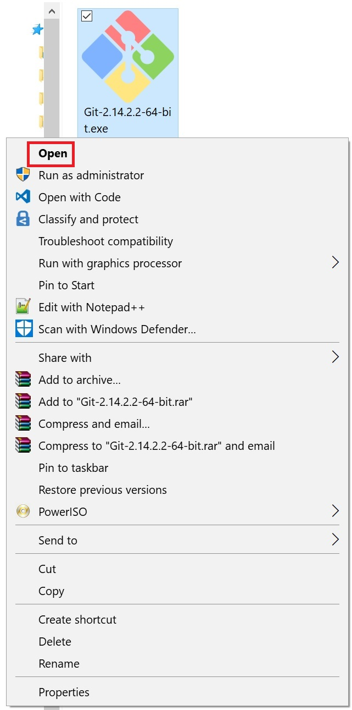)

### Step by Step Installer Instructions

Click **Next**
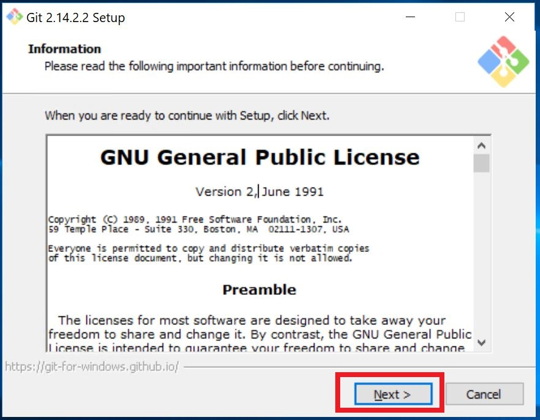
________
Give the path to install Git Binaries.

By default the path will be
```powershell
C:\Program Files\Git
```
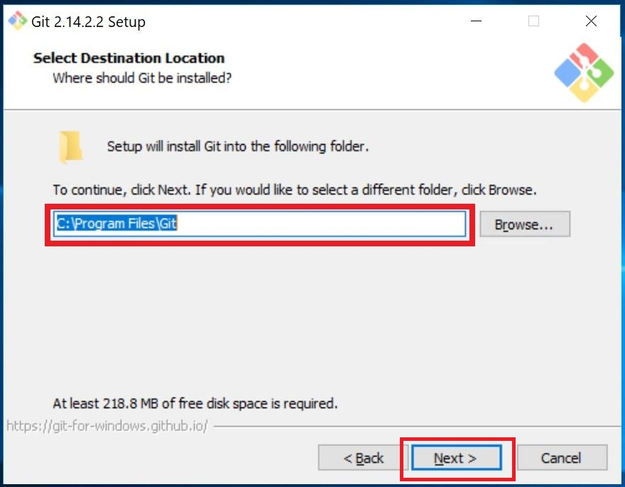
Click **Next**
_________

Click **Additional icons** > **On The Desktop** to create a shortcut on desktop
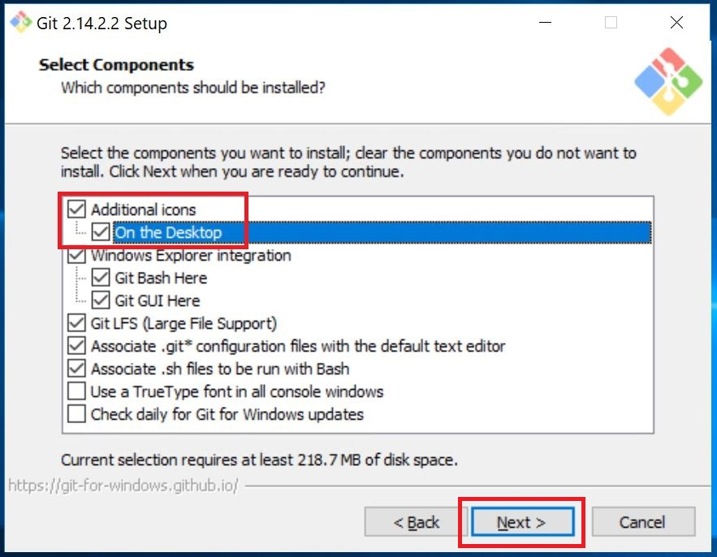
Click **Next**
_________
Give the name of the Start Menu shortcut.
By default it will be **Git**
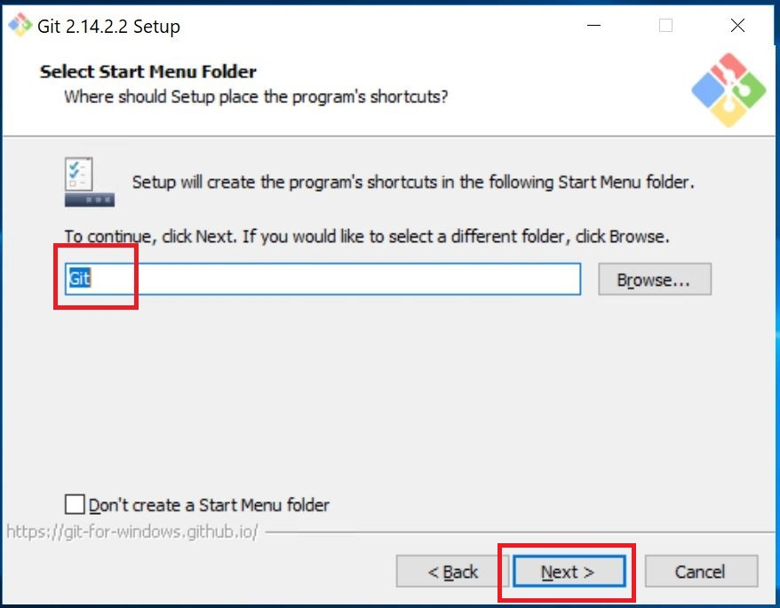
Click **Next**
_________
Pick the **Use Git from Git Bash only** option
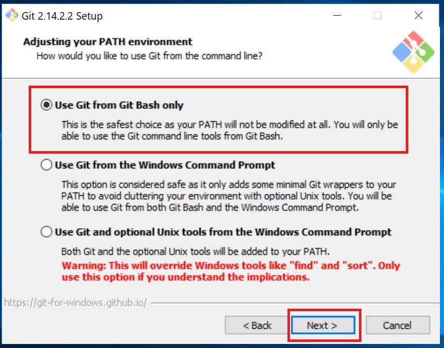
Click **Next**
_________
Pick the **Use the OpenSSL Library** option
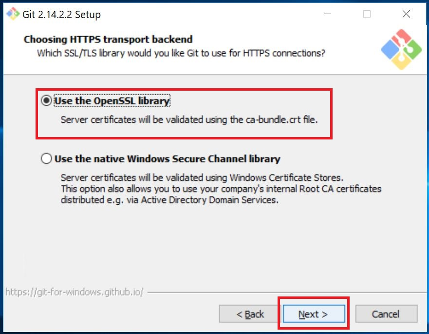
Click **Next**
_________
Pick the **Checkout as-is, commit as-is** option
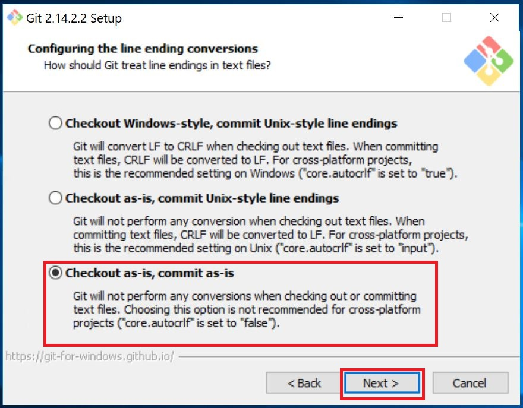
Click **Next**
_________
Pick the **Use MinTTY (the default terminal of MSYS2)** option
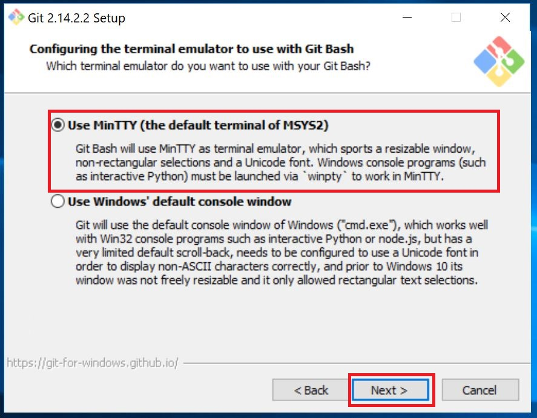
Click **Next**
_________
Pick the following two options:
*   **Enable file system cashing**
*   **Enable Git Credential Manager**
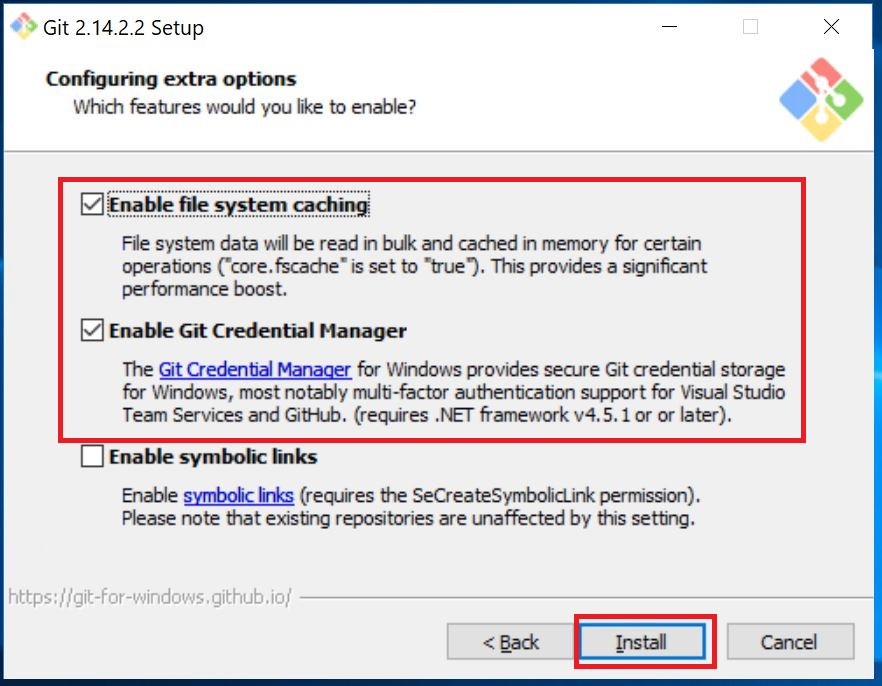
Click **Next**
_________
Wait for Installation to finish...

Once Completed. 
___
Select **Launch Git Bash** Option
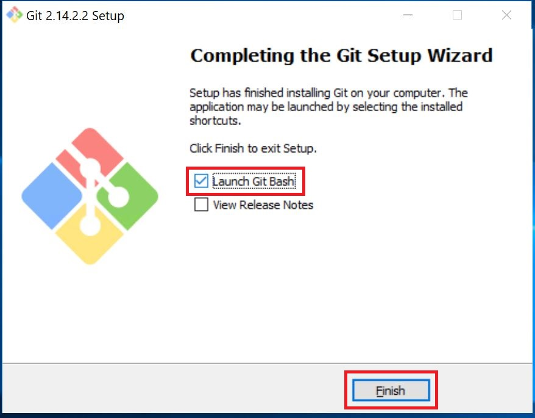
Click **Finish**
_________


ssh-keygen -t rsa -b 4096 -C "alhussai@microsoft.com"
Enter file in which to save the key (/c/Users/alihhussain/.ssh/id_rsa):
Enter passphrase (empty for no passphrase):
Enter same passphrase again:
Your identification has been saved in /c/Users/alihhussain/.ssh/id_rsa.
Your public key has been saved in /c/Users/alihhussain/.ssh/id_rsa.pub.

https://help.github.com/articles/adding-a-new-ssh-key-to-your-github-account/
mkdir ~/Documents/Github

