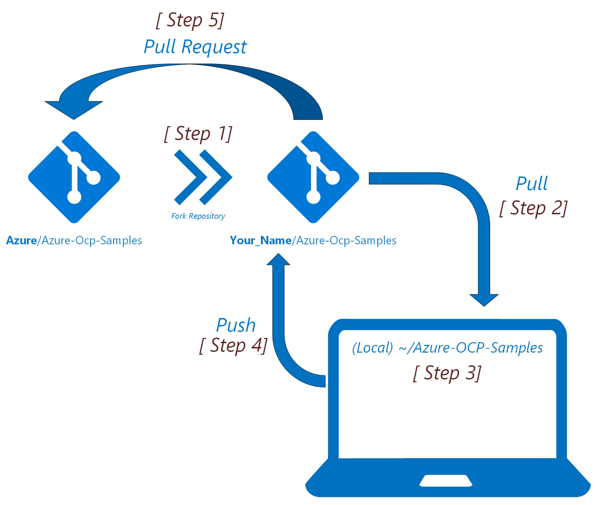

# Purpose
<<<<<<< HEAD
In this section the following GitHub scenarios are going to be discussed.
* [Installing Git](#installing-git)
*   [Setting up Git Environment with SSH](#setting-up-git-local-environment-with-ssh)
=======
In this section the following GitHub scenarios are going to be detailed.
* [Setting up Git Environment with SSH](#setting-up-git-local-environment-with-ssh)
>>>>>>> 9d77504884d253faf69e57fb365068e3eb5b8141
* [Cloning a Repository](#cloning-a-repository)
    *  Changing branches
    *  Check Status
* [Forking a repository](#forking-a-repository)
    * Committing to forked repo
    * Pushing to forked repo 
    * Syncing a forked repo with master
* [Your Modifications (Your Edits)](#your-modifications)
    *  Editing
    *  Staging
    *  Committing
    *  Pushing to forked repo
* [Open a Pull Request](#open-a-pull-request)

#   GitHub Flow


# Installing *Git* 
##  Installing *Git* on Windows

*   **Download** *Git* from [Git for Windows - GUI](https://desktop.github.com/) and **install it**.
* **Download** *Git* from [Git for Windows - GitBash](https://git-scm.com/download/win) and **install it**. 

## Installing *Git* on a *Mac*
### Step 1 – Install [*Homebrew*](http://brew.sh/)

> *Homebrew* […] simplifies the installation of software on the Mac OS X operating system.

– [Homebrew – Wikipedia](http://en.wikipedia.org/wiki/Homebrew_%28package_management_software%29)

**Copy & paste the following** into the terminal window and **hit `Return`**.

```shell
ruby -e "$(curl -fsSL https://raw.githubusercontent.com/Homebrew/install/master/install)"
brew doctor
```

You will be offered to install the *Command Line Developer Tools* from *Apple*. **Confirm by clicking *Install***. After the installation finished, continue installing *Homebrew* by **hitting `Return`** again.

### Step 2 – Install *Git*

**Copy & paste the following** into the terminal window and **hit `Return`**.

```shell
brew install git
```
## Installing *Git* on *Linux*

Determine on **which *Linux* distribution** your system is based on. See [List of Linux distributions – Wikipedia](http://en.wikipedia.org/wiki/List_of_Linux_distributions) for a list. **Most *Linux* systems – including *Ubuntu* – are *Debian*-based**.


### *Debian*-based linux systems

**[Open a terminal window](https://help.ubuntu.com/community/UsingTheTerminal). Copy & paste the following** into the terminal window and **hit `Return`**. You may be prompted to enter your password.

```shell
sudo apt-get update
sudo apt-get upgrade
sudo apt-get install git
```

### *Red Hat*-based linux systems

**Open a terminal. Copy & paste the following** into the terminal window and **hit `Return`**. You may be prompted to enter your password.

```shell
sudo yum upgrade
sudo yum install git
```


## Setting up Git Local Environment with SSH
## Forking a Repository
## Cloning A Repository
## Your Modifications
## Open a Pull Request
