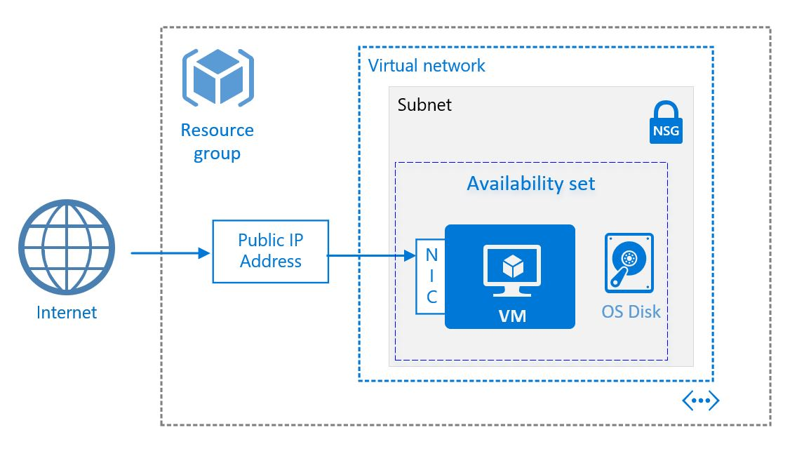

# Prerequisite for Hackathon

This section lays out all the tools that are required for this hackathon.
* **Terminal**
* **Azure Subscription**
* **Azure CLI**
* [**VS Code**](https://code.visualstudio.com/)

## Note for Windows Users

While majority of the documentation should work fine locally on Windows, I would recommend using [Windows Subsystem for Linux](https://docs.microsoft.com/en-us/windows/wsl/install-win10) for interacting with the Azure CLI.

Alternatively, you can use the [Azure Cloud Shell](https://shell.azure.com/bash). This is discussed shortly in the next section.

## Azure Sign Up

[Sign Up for Azure](https://azure.microsoft.com/en-us/free/)

Our goal is limit the cost of using Azure services. 

If you've never used Azure, you will get:
- $200 free credits for use for up to 30 days
- 12 months of popular free services  (includes storage, Linux VMs)
- Then there are services that are free up to a certain quota

Details can be found here on [free services](https://azure.microsoft.com/en-us/free/).

If you have used Azure before, we will still try to limit cost of services by suspending, shutting down services, or destroy services before end of the hackathon. You will still be able to use the free services (up to their quotas) like App Service, or Functions.

## Managing Cloud Resources

We can manage cloud resources via three separate ways:
- Web Interface/Dashboard
  - [Azure Portal](https://portal.azure.com/)
- CLI within Web Interface
  - [Azure Cloud Shell](https://shell.azure.com/bash)
- CLI
  - [Azure CLI](https://docs.microsoft.com/en-us/cli/azure/install-azure-cli)

The CLI will be the preferred (and supported) approach for this event, so please install the Azure CLI locally or use the Azure Cloud Shell from the Azure Portal.

### Azure Portal

Build, manage, and monitor everything from simple web apps to complex cloud applications in a single, unified console.

Manage your resources via a web interface (i.e. GUI) at [https://portal.azure.com/](https://portal.azure.com/)

### Azure Cloud Shell

The Azure Cloud Shell is a free interactive shell that you can use to run the steps in this article. It has common Azure tools preinstalled and configured to use with your account. Just click the **Copy** button to copy the code, paste it into the Cloud Shell, and then press enter to run it.  There are a few ways to launch the Cloud Shell:

|  |   |
|-----------------------------------------------|---|
| Click **Try It** in the upper right corner of a code block. |  |
| Open Cloud Shell in your browser. | [](https://shell.azure.com/bash) |
| Click the **Cloud Shell** button on the menu in the upper right of the [Azure portal](https://portal.azure.com). |	 |
|  |  |

### Azure CLI

The Azure CLI 2.0 is a command-line tool providing a great experience for managing Azure resources. The CLI is designed to make scripting easy, flexibly query data, support long-running operations as non-blocking processes, and more. Try it today and find out what the CLI has to offer!

- [Install on Windows](https://docs.microsoft.com/en-us/cli/azure/install-azure-cli-windows?view=azure-cli-latest)
- [Install on macOS](https://docs.microsoft.com/en-us/cli/azure/install-azure-cli-macos?view=azure-cli-latest)
- Install on Linux or Windows Subsystem for Linux (WSL)
  - [Install with apt on Debian or Ubuntu](https://docs.microsoft.com/en-us/cli/azure/install-azure-cli-apt?view=azure-cli-latest)
  - [Install with yum on RHEL, Fedora, or CentOS](https://docs.microsoft.com/en-us/cli/azure/install-azure-cli-yum?view=azure-cli-latest)
  - [Install from script](https://docs.microsoft.com/en-us/cli/azure/install-azure-cli-linux?view=azure-cli-latest)
- [Run in Docker container](https://docs.microsoft.com/en-us/cli/azure/run-azure-cli-docker?view=azure-cli-latest) - *Note*: Containers will be covered in a future class.

## Deploying a Linux Virtual Machine (IaaS)

To quickly create a virtual machine (VM) in Azure, you can use a single Azure CLI command that uses default values to create any required supporting resources. Resources such as a virtual network, public IP address, and network security group rules are automatically created. For more control of your environment in production use, you may create these resources ahead of time and then add your VMs to them. This article guides you through how to create a VM and each of the supporting resources one by one.

In the following examples, replace example parameter names with your own values. Example parameter names include myResourceGroup, myVnet, and myVM.

This tutorial requires Azure CLI (logged into an Azure Account via `az login`) or use Azure Cloud Shell.

### Create resource group
An Azure resource group is a logical container into which Azure resources are deployed and managed. A resource group must be created before a virtual machine and supporting virtual network resources. Create the resource group with [az group create](https://docs.microsoft.com/en-us/cli/azure/group?view=azure-cli-latest#az-group-create). The following example creates a resource group named *myResourceGroup* in the *eastus* location:

```azurecli
az group create --name myResourceGroup --location eastus
```

By default, the output of Azure CLI commands is in JSON (JavaScript Object Notation). To change the default output to a list or table, for example, use [az configure --output](https://docs.microsoft.com/en-us/cli/azure/reference-index?view=azure-cli-latest#az-configure). You can also add `--output` to any command for a one time change in output format. The following example shows the JSON output from the `az group create` command:

```json                       
{
  "id": "/subscriptions/guid/resourceGroups/myResourceGroup",
  "location": "eastus",
  "name": "myResourceGroup",
  "properties": {
    "provisioningState": "Succeeded"
  },
  "tags": null
}
```

### Create a virtual network and subnet
Next you create a virtual network in Azure and a subnet in to which you can create your VMs. 
<p align="center">
    
</p>

Use [az network vnet create](https://docs.microsoft.com/en-us/cli/azure/network/vnet?view=azure-cli-latest#az-network-vnet-create) to create a virtual network named *myVnet* with the *192.168.0.0/16* address prefix. You also add a subnet named *mySubnet* with the address prefix of *192.168.1.0/24*:

```azurecli
az network vnet create \
    --resource-group myResourceGroup \
    --name myVnet \
    --address-prefix 192.168.0.0/16 \
    --subnet-name mySubnet \
    --subnet-prefix 192.168.1.0/24
```

The output shows the subnet is logically created inside the virtual network:

```json
{
  "addressSpace": {
    "addressPrefixes": [
      "192.168.0.0/16"
    ]
  },
  "dhcpOptions": {
    "dnsServers": []
  },
  "etag": "W/\"e95496fc-f417-426e-a4d8-c9e4d27fc2ee\"",
  "id": "/subscriptions/guid/resourceGroups/myResourceGroup/providers/Microsoft.Network/virtualNetworks/myVnet",
  "location": "eastus",
  "name": "myVnet",
  "provisioningState": "Succeeded",
  "resourceGroup": "myResourceGroup",
  "resourceGuid": "ed62fd03-e9de-430b-84df-8a3b87cacdbb",
  "subnets": [
    {
      "addressPrefix": "192.168.1.0/24",
      "etag": "W/\"e95496fc-f417-426e-a4d8-c9e4d27fc2ee\"",
      "id": "/subscriptions/guid/resourceGroups/myResourceGroup/providers/Microsoft.Network/virtualNetworks/myVnet/subnets/mySubnet",
      "ipConfigurations": null,
      "name": "mySubnet",
      "networkSecurityGroup": null,
      "provisioningState": "Succeeded",
      "resourceGroup": "myResourceGroup",
      "resourceNavigationLinks": null,
      "routeTable": null
    }
  ],
  "tags": {},
  "type": "Microsoft.Network/virtualNetworks",
  "virtualNetworkPeerings": null
}
```


### Create a public IP address
Now let's create a public IP address with [az network public-ip create](https://docs.microsoft.com/en-us/cli/azure/network/public-ip?view=azure-cli-latest#az-network-public-ip-create). This public IP address enables you to connect to your VMs from the Internet. Because the default address is dynamic, create a named DNS entry with the `--domain-name-label` parameter. The following example creates a public IP named *myPublicIP* with the DNS name of *mypublicdns*. Because the DNS name must be unique, provide your own unique DNS name:

```azurecli
az network public-ip create \
    --resource-group myResourceGroup \
    --name myPublicIP \
    --dns-name mypublicdns
```

Output:

```json
{
  "publicIp": {
    "dnsSettings": {
      "domainNameLabel": "mypublicdns",
      "fqdn": "mypublicdns.eastus.cloudapp.azure.com",
      "reverseFqdn": null
    },
    "etag": "W/\"2632aa72-3d2d-4529-b38e-b622b4202925\"",
    "id": "/subscriptions/guid/resourceGroups/myResourceGroup/providers/Microsoft.Network/publicIPAddresses/myPublicIP",
    "idleTimeoutInMinutes": 4,
    "ipAddress": null,
    "ipConfiguration": null,
    "location": "eastus",
    "name": "myPublicIP",
    "provisioningState": "Succeeded",
    "publicIpAddressVersion": "IPv4",
    "publicIpAllocationMethod": "Dynamic",
    "resourceGroup": "myResourceGroup",
    "resourceGuid": "4c65de38-71f5-4684-be10-75e605b3e41f",
    "tags": null,
    "type": "Microsoft.Network/publicIPAddresses"
  }
}
```


### Create a network security group
To control the flow of traffic in and out of your VMs, you apply a network security group to a virtual NIC or subnet. The following example uses [az network nsg create](https://docs.microsoft.com/en-us/cli/azure/network/nsg?view=azure-cli-latest#az-network-nsg-create) to create a network security group named *myNetworkSecurityGroup*:

```azurecli
az network nsg create \
    --resource-group myResourceGroup \
    --name myNetworkSecurityGroup
```

You define rules that allow or deny specific traffic. To allow inbound connections on port 22 (to enable SSH access), create an inbound rule with [az network nsg rule create](https://docs.microsoft.com/en-us/cli/azure/network/nsg/rule?view=azure-cli-latest#az-network-nsg-rule-create). The following example creates a rule named *myNetworkSecurityGroupRuleSSH*:

```azurecli
az network nsg rule create \
    --resource-group myResourceGroup \
    --nsg-name myNetworkSecurityGroup \
    --name myNetworkSecurityGroupRuleSSH \
    --protocol tcp \
    --priority 1000 \
    --destination-port-range 22 \
    --access allow
```

To allow inbound connections on port 80 (for web traffic), add another network security group rule. The following example creates a rule named *myNetworkSecurityGroupRuleHTTP*:

```azurecli
az network nsg rule create \
    --resource-group myResourceGroup \
    --nsg-name myNetworkSecurityGroup \
    --name myNetworkSecurityGroupRuleWeb \
    --protocol tcp \
    --priority 1001 \
    --destination-port-range 80 \
    --access allow
```

Examine the network security group and rules with [az network nsg show](https://docs.microsoft.com/en-us/cli/azure/network/nsg?view=azure-cli-latest#az-network-nsg-show):

```azurecli
az network nsg show --resource-group myResourceGroup --name myNetworkSecurityGroup
```

Output:

```json
{
  "defaultSecurityRules": [
    {
      "access": "Allow",
      "description": "Allow inbound traffic from all VMs in VNET",
      "destinationAddressPrefix": "VirtualNetwork",
      "destinationPortRange": "*",
      "direction": "Inbound",
      "etag": "W/\"3371b313-ea9f-4687-a336-a8ebdfd80523\"",
      "id": "/subscriptions/guid/resourceGroups/myResourceGroup/providers/Microsoft.Network/networkSecurityGroups/myNetworkSecurityGroup/defaultSecurityRules/AllowVnetInBound",
      "name": "AllowVnetInBound",
      "priority": 65000,
      "protocol": "*",
      "provisioningState": "Succeeded",
      "resourceGroup": "myResourceGroup",
      "sourceAddressPrefix": "VirtualNetwork",
      "sourcePortRange": "*"
    },
    {
      "access": "Allow",
      "description": "Allow inbound traffic from azure load balancer",
      "destinationAddressPrefix": "*",
      "destinationPortRange": "*",
      "direction": "Inbound",
      "etag": "W/\"3371b313-ea9f-4687-a336-a8ebdfd80523\"",
      "id": "/subscriptions/guid/resourceGroups/myResourceGroup/providers/Microsoft.Network/networkSecurityGroups/myNetworkSecurityGroup/defaultSecurityRules/AllowAzureLoadBalancerInBou
      "name": "AllowAzureLoadBalancerInBound",
      "priority": 65001,
      "protocol": "*",
      "provisioningState": "Succeeded",
      "resourceGroup": "myResourceGroup",
      "sourceAddressPrefix": "AzureLoadBalancer",
      "sourcePortRange": "*"
    },
    {
      "access": "Deny",
      "description": "Deny all inbound traffic",
      "destinationAddressPrefix": "*",
      "destinationPortRange": "*",
      "direction": "Inbound",
      "etag": "W/\"3371b313-ea9f-4687-a336-a8ebdfd80523\"",
      "id": "/subscriptions/guid/resourceGroups/myResourceGroup/providers/Microsoft.Network/networkSecurityGroups/myNetworkSecurityGroup/defaultSecurityRules/DenyAllInBound",
      "name": "DenyAllInBound",
      "priority": 65500,
      "protocol": "*",
      "provisioningState": "Succeeded",
      "resourceGroup": "myResourceGroup",
      "sourceAddressPrefix": "*",
      "sourcePortRange": "*"
    },
    {
      "access": "Allow",
      "description": "Allow outbound traffic from all VMs to all VMs in VNET",
      "destinationAddressPrefix": "VirtualNetwork",
      "destinationPortRange": "*",
      "direction": "Outbound",
      "etag": "W/\"3371b313-ea9f-4687-a336-a8ebdfd80523\"",
      "id": "/subscriptions/guid/resourceGroups/myResourceGroup/providers/Microsoft.Network/networkSecurityGroups/myNetworkSecurityGroup/defaultSecurityRules/AllowVnetOutBound",
      "name": "AllowVnetOutBound",
      "priority": 65000,
      "protocol": "*",
      "provisioningState": "Succeeded",
      "resourceGroup": "myResourceGroup",
      "sourceAddressPrefix": "VirtualNetwork",
      "sourcePortRange": "*"
    },
    {
      "access": "Allow",
      "description": "Allow outbound traffic from all VMs to Internet",
      "destinationAddressPrefix": "Internet",
      "destinationPortRange": "*",
      "direction": "Outbound",
      "etag": "W/\"3371b313-ea9f-4687-a336-a8ebdfd80523\"",
      "id": "/subscriptions/guid/resourceGroups/myResourceGroup/providers/Microsoft.Network/networkSecurityGroups/myNetworkSecurityGroup/defaultSecurityRules/AllowInternetOutBound",
      "name": "AllowInternetOutBound",
      "priority": 65001,
      "protocol": "*",
      "provisioningState": "Succeeded",
      "resourceGroup": "myResourceGroup",
      "sourceAddressPrefix": "*",
      "sourcePortRange": "*"
    },
    {
      "access": "Deny",
      "description": "Deny all outbound traffic",
      "destinationAddressPrefix": "*",
      "destinationPortRange": "*",
      "direction": "Outbound",
      "etag": "W/\"3371b313-ea9f-4687-a336-a8ebdfd80523\"",
      "id": "/subscriptions/guid/resourceGroups/myResourceGroup/providers/Microsoft.Network/networkSecurityGroups/myNetworkSecurityGroup/defaultSecurityRules/DenyAllOutBound",
      "name": "DenyAllOutBound",
      "priority": 65500,
      "protocol": "*",
      "provisioningState": "Succeeded",
      "resourceGroup": "myResourceGroup",
      "sourceAddressPrefix": "*",
      "sourcePortRange": "*"
    }
  ],
  "etag": "W/\"3371b313-ea9f-4687-a336-a8ebdfd80523\"",
  "id": "/subscriptions/guid/resourceGroups/myResourceGroup/providers/Microsoft.Network/networkSecurityGroups/myNetworkSecurityGroup",
  "location": "eastus",
  "name": "myNetworkSecurityGroup",
  "networkInterfaces": null,
  "provisioningState": "Succeeded",
  "resourceGroup": "myResourceGroup",
  "resourceGuid": "47a9964e-23a3-438a-a726-8d60ebbb1c3c",
  "securityRules": [
    {
      "access": "Allow",
      "description": null,
      "destinationAddressPrefix": "*",
      "destinationPortRange": "22",
      "direction": "Inbound",
      "etag": "W/\"9e344b60-0daa-40a6-84f9-0ebbe4a4b640\"",
      "id": "/subscriptions/guid/resourceGroups/myResourceGroup/providers/Microsoft.Network/networkSecurityGroups/myNetworkSecurityGroup/securityRules/myNetworkSecurityGroupRuleSSH",
      "name": "myNetworkSecurityGroupRuleSSH",
      "priority": 1000,
      "protocol": "Tcp",
      "provisioningState": "Succeeded",
      "resourceGroup": "myResourceGroup",
      "sourceAddressPrefix": "*",
      "sourcePortRange": "*"
    },
    {
      "access": "Allow",
      "description": null,
      "destinationAddressPrefix": "*",
      "destinationPortRange": "80",
      "direction": "Inbound",
      "etag": "W/\"9e344b60-0daa-40a6-84f9-0ebbe4a4b640\"",
      "id": "/subscriptions/guid/resourceGroups/myResourceGroup/providers/Microsoft.Network/networkSecurityGroups/myNetworkSecurityGroup/securityRules/myNetworkSecurityGroupRuleWeb",
      "name": "myNetworkSecurityGroupRuleWeb",
      "priority": 1001,
      "protocol": "Tcp",
      "provisioningState": "Succeeded",
      "resourceGroup": "myResourceGroup",
      "sourceAddressPrefix": "*",
      "sourcePortRange": "*"
    }
  ],
  "subnets": null,
  "tags": null,
  "type": "Microsoft.Network/networkSecurityGroups"
}
```

### Create a virtual NIC
Virtual network interface cards (NICs) are programmatically available because you can apply rules to their use. Depending on the [VM size](sizes.md), you can attach multiple virtual NICs to a VM. In the following [az network nic create](https://docs.microsoft.com/en-us/cli/azure/network/nic?view=azure-cli-latest#az-network-nic-create) command, you create a NIC named *myNic* and associate it with your network security group. The public IP address *myPublicIP* is also associated with the virtual NIC.

```azurecli
az network nic create \
    --resource-group myResourceGroup \
    --name myNic \
    --vnet-name myVnet \
    --subnet mySubnet \
    --public-ip-address myPublicIP \
    --network-security-group myNetworkSecurityGroup
```

Output:

```json
{
  "NewNIC": {
    "dnsSettings": {
      "appliedDnsServers": [],
      "dnsServers": [],
      "internalDnsNameLabel": null,
      "internalDomainNameSuffix": "brqlt10lvoxedgkeuomc4pm5tb.bx.internal.cloudapp.net",
      "internalFqdn": null
    },
    "enableAcceleratedNetworking": false,
    "enableIpForwarding": false,
    "etag": "W/\"04b5ab44-d8f4-422a-9541-e5ae7de8466d\"",
    "id": "/subscriptions/guid/resourceGroups/myResourceGroup/providers/Microsoft.Network/networkInterfaces/myNic",
    "ipConfigurations": [
      {
        "applicationGatewayBackendAddressPools": null,
        "etag": "W/\"04b5ab44-d8f4-422a-9541-e5ae7de8466d\"",
        "id": "/subscriptions/guid/resourceGroups/myResourceGroup/providers/Microsoft.Network/networkInterfaces/myNic/ipConfigurations/ipconfig1",
        "loadBalancerBackendAddressPools": null,
        "loadBalancerInboundNatRules": null,
        "name": "ipconfig1",
        "primary": true,
        "privateIpAddress": "192.168.1.4",
        "privateIpAddressVersion": "IPv4",
        "privateIpAllocationMethod": "Dynamic",
        "provisioningState": "Succeeded",
        "publicIpAddress": {
          "dnsSettings": null,
          "etag": null,
          "id": "/subscriptions/guid/resourceGroups/myResourceGroup/providers/Microsoft.Network/publicIPAddresses/myPublicIP",
          "idleTimeoutInMinutes": null,
          "ipAddress": null,
          "ipConfiguration": null,
          "location": null,
          "name": null,
          "provisioningState": null,
          "publicIpAddressVersion": null,
          "publicIpAllocationMethod": null,
          "resourceGroup": "myResourceGroup",
          "resourceGuid": null,
          "tags": null,
          "type": null
        },
        "resourceGroup": "myResourceGroup",
        "subnet": {
          "addressPrefix": null,
          "etag": null,
          "id": "/subscriptions/guid/resourceGroups/myResourceGroup/providers/Microsoft.Network/virtualNetworks/myVnet/subnets/mySubnet",
          "ipConfigurations": null,
          "name": null,
          "networkSecurityGroup": null,
          "provisioningState": null,
          "resourceGroup": "myResourceGroup",
          "resourceNavigationLinks": null,
          "routeTable": null
        }
      }
    ],
    "location": "eastus",
    "macAddress": null,
    "name": "myNic",
    "networkSecurityGroup": {
      "defaultSecurityRules": null,
      "etag": null,
      "id": "/subscriptions/guid/resourceGroups/myResourceGroup/providers/Microsoft.Network/networkSecurityGroups/myNetworkSecurityGroup",
      "location": null,
      "name": null,
      "networkInterfaces": null,
      "provisioningState": null,
      "resourceGroup": "myResourceGroup",
      "resourceGuid": null,
      "securityRules": null,
      "subnets": null,
      "tags": null,
      "type": null
    },
    "primary": null,
    "provisioningState": "Succeeded",
    "resourceGroup": "myResourceGroup",
    "resourceGuid": "b3dbaa0e-2cf2-43be-a814-5cc49fea3304",
    "tags": null,
    "type": "Microsoft.Network/networkInterfaces",
    "virtualMachine": null
  }
}
```


### Create an availability set
Availability sets help spread your VMs across fault domains and update domains. Even though you only create one VM right now, it's best practice to use availability sets to make it easier to expand in the future. 

Fault domains define a grouping of virtual machines that share a common power source and network switch. By default, the virtual machines that are configured within your availability set are separated across up to three fault domains. A hardware issue in one of these fault domains does not affect every VM that is running your app.

Update domains indicate groups of virtual machines and underlying physical hardware that can be rebooted at the same time. During planned maintenance, the order in which update domains are rebooted might not be sequential, but only one update domain is rebooted at a time.

Azure automatically distributes VMs across the fault and update domains when placing them in an availability set. For more information, see [managing the availability of VMs](https://docs.microsoft.com/en-us/azure/virtual-machines/linux/manage-availability).

Create an availability set for your VM with [az vm availability-set create](https://docs.microsoft.com/en-us/cli/azure/vm/availability-set?view=azure-cli-latest#az-vm-availability-set-create). The following example creates an availability set named *myAvailabilitySet*:

```azurecli
az vm availability-set create \
    --resource-group myResourceGroup \
    --name myAvailabilitySet
```

The output notes fault domains and update domains:

```json
{
  "id": "/subscriptions/guid/resourceGroups/myResourceGroup/providers/Microsoft.Compute/availabilitySets/myAvailabilitySet",
  "location": "eastus",
  "managed": null,
  "name": "myAvailabilitySet",
  "platformFaultDomainCount": 2,
  "platformUpdateDomainCount": 5,
  "resourceGroup": "myResourceGroup",
  "sku": {
    "capacity": null,
    "managed": true,
    "tier": null
  },
  "statuses": null,
  "tags": {},
  "type": "Microsoft.Compute/availabilitySets",
  "virtualMachines": []
}
```

### Create a VM
You've created the network resources to support Internet-accessible VMs. Now create a VM and secure it with an SSH key. In this example, let's create an Ubuntu VM based on the most recent LTS. You can find additional images with [az vm image list](https://docs.microsoft.com/en-us/cli/azure/vm/image?view=azure-cli-latest#az-vm-image-list), as described in [finding Azure VM images](https://docs.microsoft.com/en-us/azure/virtual-machines/linux/cli-ps-findimage).

**Note**: We will be using SSH keys which typically work better on Linux or Mac. For Windows SSH key info go [here](https://docs.microsoft.com/en-us/azure/virtual-machines/linux/ssh-from-windows). Alternatively, use the Azure Cloud Shell. Or use [Windows Subsystem for Linux](https://docs.microsoft.com/en-us/windows/wsl/install-win10)

Specify an SSH key to use for authentication. If you do not have an SSH public key pair, you can [create them](https://docs.microsoft.com/en-us/azure/virtual-machines/linux/mac-create-ssh-keys) or use the `--generate-ssh-keys` parameter to create them for you. If you already have a key pair, this parameter uses existing keys in `~/.ssh`.

Create the VM by bringing all the resources and information together with the [az vm create](https://docs.microsoft.com/en-us/cli/azure/vm?view=azure-cli-latest#az-vm-create) command. The following example creates a VM named *myVM*:

```azurecli
az vm create \
    --resource-group myResourceGroup \
    --name myVM \
    --location eastus \
    --availability-set myAvailabilitySet \
    --nics myNic \
    --image UbuntuLTS \
    --admin-username azureuser \
    --generate-ssh-keys
```

SSH to your VM with the DNS entry you provided when you created the public IP address. This `fqdn` is shown in the output as you create your VM:

```json
{
  "fqdns": "mypublicdns.eastus.cloudapp.azure.com",
  "id": "/subscriptions/guid/resourceGroups/myResourceGroup/providers/Microsoft.Compute/virtualMachines/myVM",
  "location": "eastus",
  "macAddress": "00-0D-3A-13-71-C8",
  "powerState": "VM running",
  "privateIpAddress": "192.168.1.5",
  "publicIpAddress": "13.90.94.252",
  "resourceGroup": "myResourceGroup"
}
```

```bash
ssh azureuser@mypublicdns.eastus.cloudapp.azure.com

# alternatively using <publicIpAddress>
ssh azureuser@<publicIpAddress>
```

Output:

```bash
The authenticity of host 'mypublicdns.eastus.cloudapp.azure.com (13.90.94.252)' can't be established.
ECDSA key fingerprint is SHA256:SylINP80Um6XRTvWiFaNz+H+1jcrKB1IiNgCDDJRj6A.
Are you sure you want to continue connecting (yes/no)? yes
Warning: Permanently added 'mypublicdns.eastus.cloudapp.azure.com,13.90.94.252' (ECDSA) to the list of known hosts.
Welcome to Ubuntu 16.04.3 LTS (GNU/Linux 4.11.0-1016-azure x86_64)

 * Documentation:  https://help.ubuntu.com
 * Management:     https://landscape.canonical.com
 * Support:        https://ubuntu.com/advantage

  Get cloud support with Ubuntu Advantage Cloud Guest:
    http://www.ubuntu.com/business/services/cloud

0 packages can be updated.
0 updates are security updates.


The programs included with the Ubuntu system are free software;
the exact distribution terms for each program are described in the
individual files in /usr/share/doc/*/copyright.

Ubuntu comes with ABSOLUTELY NO WARRANTY, to the extent permitted by
applicable law.

To run a command as administrator (user "root"), use "sudo <command>".
See "man sudo_root" for details.

azureuser@myVM:~$
```

You can install NGINX and see the traffic flow to the VM. Install NGINX as follows:

```bash
# update package source
sudo apt-get -y update

# install NGINX
sudo apt-get -y install nginx
```

To see the default NGINX site in action, open your web browser and enter your FQDN:


## Export as a template

**NOTE**: The Export feature doesn't always work the best and the output needs to be tweaked with, if you run into errors redeploying you'll have to review the documentation syntax here: [https://docs.microsoft.com/en-us/azure/azure-resource-manager/resource-group-authoring-templates](https://docs.microsoft.com/en-us/azure/azure-resource-manager/resource-group-authoring-templates)

What if you now want to create an additional development environment with the same parameters, or a production environment that matches it? Resource Manager uses JSON templates that define all the parameters for your environment. You build out entire environments by referencing this JSON template. You can [build JSON templates manually](https://docs.microsoft.com/en-us/azure/azure-resource-manager/resource-group-authoring-templates?toc=%2Fazure%2Fvirtual-machines%2Flinux%2Ftoc.json) or export an existing environment to create the JSON template for you. Use [az group export](https://docs.microsoft.com/en-us/cli/azure/group?view=azure-cli-latest#az-group-export) to export your resource group as follows:

```azurecli
az group export --name myResourceGroup > myResourceGroup.json
```

This command creates the `myResourceGroup.json` file in your current working directory. When you create an environment from this template, you are prompted for all the resource names. You can populate these names in your template file by adding the `--include-parameter-default-value` parameter to the `az group export` command. Edit your JSON template to specify the resource names, or [create a parameters.json file](https://docs.microsoft.com/en-us/azure/azure-resource-manager/resource-group-authoring-templates?toc=%2Fazure%2Fvirtual-machines%2Flinux%2Ftoc.json) that specifies the resource names.

To create an environment from your template, use [az group deployment create](https://docs.microsoft.com/en-us/cli/azure/group/deployment?view=azure-cli-latest#az-group-deployment-create) as follows:

```azurecli
az group deployment create \
    --resource-group myNewResourceGroup \
    --template-file myResourceGroup.json
```

You might want to read [more about how to deploy from templates](https://docs.microsoft.com/en-us/azure/azure-resource-manager/resource-group-template-deploy-cli?toc=%2Fazure%2Fvirtual-machines%2Flinux%2Ftoc.json). Learn about how to incrementally update environments, use the parameters file, and access templates from a single storage location.

### Destroy Your Resources

To save money let's destroy the resources with one command!

```azure
az group delete -n <RESOURCE_GROUP_NAME>
```
