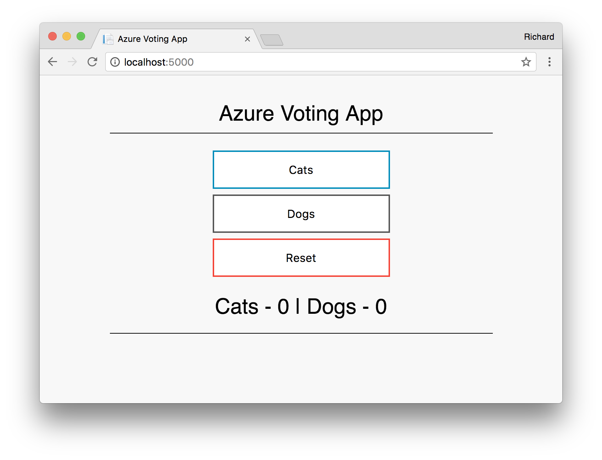

# Module 02: App Service for Web Apps

## Overview
*App Service Web Apps* is a fully managed compute platform that is optimized for hosting websites and web applications. This [platform-as-a-service](https://en.wikipedia.org/wiki/Platform_as_a_service) (PaaS) offering of Microsoft Azure lets you focus on your business logic while Azure takes care of the infrastructure to run and scale your apps. 

### What is a web app in App Service?
In App Service, a *web app* is the compute resources that Azure provides for hosting a website or web application.  

The compute resources may be on shared or dedicated virtual machines (VMs), depending on the pricing tier that you choose. Your application code runs in a managed VM that is isolated from other customers.

Your code can be in any language or framework that is supported by Azure App Service, such as ASP.NET, Node.js, Java, PHP, or Python. You can also run scripts that use PowerShell and other scripting languages in a web app.


### Why use Web Apps?
Here are some key features of App Service that apply to Web Apps:

* **Multiple languages and frameworks** - App Service has first-class support for ASP.NET, Node.js, Java, PHP, and Python. You can also run PowerShell and other scripts or executables on App Service VMs.
* **DevOps optimization** - Set up continuous integration and deployment with Visual Studio Team Services, GitHub, or BitBucket. Promote updates through test and staging environments. Manage your apps in App Service by using cross-platform command-line interface (Azure CLI 2.0), Azure PowerShell, or the portal.
* **Global scale with high availability** - Scale up or out manually or automatically. Host your apps anywhere in Microsoft's global datacenter infrastructure, and the App Service [SLA](https://azure.microsoft.com/support/legal/sla/app-service/) promises high availability.
* **Connections to SaaS platforms and on-premises data** - Choose from more than 50 connectors for enterprise systems (such as SAP, Siebel, and Oracle), SaaS services (such as Salesforce and Office 365), and internet services (such as Facebook and Twitter). Access on-premises data using [Hybrid Connections](https://docs.microsoft.com/en-us/azure/biztalk-services/integration-hybrid-connection-overview) and [Azure Virtual Networks](https://docs.microsoft.com/en-us/azure/app-service/web-sites-integrate-with-vnet).
* **Security and compliance** - App Service is [ISO, SOC, and PCI compliant](https://www.microsoft.com/TrustCenter/).
* **Application templates** - Choose from an extensive list of application templates in the [Azure Marketplace](https://azure.microsoft.com/marketplace/) that let you use a wizard to install popular open-source software such as WordPress, Joomla, and Drupal.
* **Visual Studio integration** - Dedicated tools in Visual Studio streamline the work of creating, deploying, and debugging.

In addition, a web app can take advantage of features offered by API Apps (such as CORS support) and Mobile Apps (such as push notifications). 

Besides Web Apps in App Service, Azure offers other services that can be used for hosting websites and web applications. For most scenarios, Web Apps is the best choice.  For microservice architecture, consider [Service Fabric](https://azure.microsoft.com/documentation/services/service-fabric), and if you need more control over the VMs that your code runs on, consider [Azure Virtual Machines](https://azure.microsoft.com/documentation/services/virtual-machines/). For more information about how to choose between these Azure services, see [Azure App Service, Virtual Machines, Service Fabric, and Cloud Services comparison](choose-web-site-cloud-service-vm.md).

## Hands-on Lab

This module walks through how to develop and deploy a Python app to Azure Web Apps. You create the web app using the [Azure CLI](https://docs.microsoft.com/cli/azure/get-started-with-azure-cli), and you use Git to deploy sample Python code to the web app.


You can follow the steps below using a Mac, Windows, or Linux machine. Once the prerequisites are installed, it takes about five minutes to complete the steps.

## Prerequisites

To complete this tutorial you will need:

1. [Git](https://git-scm.com/)
2. [Python](https://www.python.org/downloads/)
3. [Azure CLI](https://docs.microsoft.com/cli/azure/get-started-with-azure-cli) or use [Azure Cloudshell](https://docs.microsoft.com/en-us/azure/cloud-shell/quickstart)

This tutorial assumes you have an active Azure Subscription, otherwise a free trial can be used (or using the Free Tier of App Service).

If you don't have an Azure subscription, create a [free account](https://azure.microsoft.com/free/) before you begin.

## Download the sample

Clone this repo:

```bash
git clone https://github.com/AzureCAT-GSI/azure-serverless-workshop.git
```

You use this terminal window to run all the commands in this quickstart.

## Run the app locally

Install the required packages using `pip`. The following command may need admin privileges such as `sudo` in Linux/Mac, or running in Administrator Mode with PowerShell.

```bash
pip install -r requirements.txt
```

Run the application locally by opening a terminal window and using the `Python` command to launch the built-in Python web server.

```bash
python main.py
```

Open a web browser, and navigate to the sample app at [http://localhost:5000](http://localhost:5000).

You can see the voting app displayed in the page.



So now we have our app running locally. This app is intentionally  simple and stateless. Now that we are happy with it. Let's get it on App Service.

In your terminal window, press **Ctrl+C** to exit the web server.

## Setting up App Service

### Configure Deployment User

A deployment user is required for FTP and local Git deployment to a web app. The user name and password are account level. They are different from your Azure subscription credentials.

In the following command [az webapp deployment user set](https://docs.microsoft.com/en-us/cli/azure/webapp/deployment/user?view=azure-cli-latest#az_webapp_deployment_user_set), replace <username> and <password> with a new user name and password. The user name must be unique. The password must be at least eight characters long, with two of the following three elements: letters, numbers, symbols.

```
az webapp deployment user set --user-name <username> --password <password>
```

If you get a 'Conflict'. Details: 409 error, change the username. If you get a 'Bad Request'. Details: 400 error, use a stronger password.

You create this deployment user only once; you can use it for all your Azure deployments.

*Record the user name and password. You need them to deploy the web app later.*

### Create Resource Group

The following example uses the [az group create](https://docs.microsoft.com/en-us/cli/azure/group?view=azure-cli-latest#az_group_create) creates a resource group named serverlessWorkshop02 in the East US location.

```
az group create --name serverlessWorkshop02 --location eastus
```

You generally create your resource group and the resources in a region near you. To see all supported locations for Azure Web Apps, run the `az appservice list-locations` command.

### Create App Service Plan

An [App Service plan](https://docs.microsoft.com/en-us/azure/app-service/azure-web-sites-web-hosting-plans-in-depth-overview) specifies the location, size, and features of the web server farm that hosts your app. You can save money when hosting multiple apps by configuring the web apps to share a single App Service plan.

App Service plans define:

* Region (for example: North Europe, East US, or Southeast Asia)
* Instance size (small, medium, or large)
* Scale count (1 to 20 instances)
* SKU (Free, Shared, Basic, Standard, or Premium)

**Note**: It is important to know what types of applications you will be deploying to App Service. For instance, you cannot deploy Linux and non-Linux (e.g. Windows) applications in the same App Service Plan. By default, App Service will default to a Windows environment, however has support for many runtimes (e.g. Python, Ruby, NodeJS, etc). If you're looking to deploy Linux applications natively on Linux, then you use the `--is-linux` flag when create your App Service plan. Note, that support for Linux requires using a `Standard` or `Premium` SKU when creating an App Service Plan (currently we are not using that).

The following example uses the [az appservice plan create](https://docs.microsoft.com/en-us/cli/azure/appservice/plan?view=azure-cli-latest#az_appservice_plan_create) creates an App Service plan named `myAppServicePlan` in the **Free** pricing tier:

```
az appservice plan create --name myAppServicePlan --resource-group serverlessWorkshop02 --sku FREE
```

When the App Service plan has been created, the Azure CLI shows information similar to the following example:

```json
{ 
  "adminSiteName": null,
  "appServicePlanName": "myAppServicePlan",
  "geoRegion": "West Europe",
  "hostingEnvironmentProfile": null,
  "id": "/subscriptions/0000-0000/resourceGroups/myResourceGroup/providers/Microsoft.Web/serverfarms/myAppServicePlan",
  "kind": "app",
  "location": "West Europe",
  "maximumNumberOfWorkers": 1,
  "name": "myAppServicePlan",
  < JSON data removed for brevity. >
  "targetWorkerSizeId": 0,
  "type": "Microsoft.Web/serverfarms",
  "workerTierName": null
} 
```

### Create web app

From your terminal window, create a web app in the `myAppServicePlan` App Service plan with the [az webapp create](https://docs.microsoft.com/en-us/cli/azure/webapp?view=azure-cli-latest#az_webapp_create) command. 

The web app provides a hosting space for your code and provides a URL to view the deployed app.

In the following command, replace *\<app_name>* with a unique name (valid characters are `a-z`, `0-9`, and `-`). If `<app_name>` is not unique, you get the error message "Website with given name <app_name> already exists." The default URL of the web app is `https://<app_name>.azurewebsites.net`. 


```
az webapp create --name <app_name> --resource-group serverlessWorkshop02 --plan myAppServicePlan --deployment-local-git
```


When the web app has been created, the Azure CLI shows information similar to the following example:

```json
{
  "availabilityState": "Normal",
  "clientAffinityEnabled": true,
  "clientCertEnabled": false,
  "cloningInfo": null,
  "containerSize": 0,
  "dailyMemoryTimeQuota": 0,
  "defaultHostName": "<app_name>.azurewebsites.net",
  "enabled": true,
  "enabledHostNames": [
    "<app_name>.azurewebsites.net",
    "<app_name>.scm.azurewebsites.net"
  ],
  "gatewaySiteName": null,
  "hostNameSslStates": [
    {
      "hostType": "Standard",
      "name": "<app_name>.azurewebsites.net",
      "sslState": "Disabled",
      "thumbprint": null,
      "toUpdate": null,
      "virtualIp": null
    }
    < JSON data removed for brevity. >
}
```

Browse to the site to see your newly created web app.

```bash
http://<app_name>.azurewebsites.net
```


You’ve created an empty new web app in Azure.

## Configure App Service to use Python

Use the [az webapp config set](https://docs.microsoft.com/en-us/cli/azure/webapp/config?view=azure-cli-latest#az_webapp_config_set) command to configure the web app to use Python version `3.4`.

```
az webapp config set --python-version 3.4 --name <app_name> --resource-group serverlessWorkshop02
```

Setting the Python version this way uses a default container provided by the platform. To use your own container, see the CLI reference for the [az webapp config container set](https://docs.microsoft.com/en-us/cli/azure/webapp/config/container?view=azure-cli-latest#az_webapp_config_container_set) command.

We will also need to change the default path in App Service so it looks for the code in the right folder. Our application is under `02_app-service/code` and we need App Service to know to check there. Also while we are setting environment variables, let's tell our application it's in `PRODUCTION` environment mode which the app will use to determine it's starting port. 

```
az webapp config appsettings set --name <app_name> --resource-group serverlessWorkshop02 --settings  ENVIRONMENT=production
```

## Configure App Service for local git

Configure local Git deployment to the web app with the [az webapp deployment source config-local-git](https://docs.microsoft.com/en-us/cli/azure/webapp/deployment/source?view=azure-cli-latest#az_webapp_deployment_source_config_local_git) command.

App Service supports several ways to deploy content to a web app, such as FTP, local Git, GitHub, Visual Studio Team Services, and Bitbucket. For this quickstart, you deploy by using local Git. That means you deploy by using a Git command to push from a local repository to a repository in Azure. 

In the following command, replace *\<app_name>* with your web app's name.

```
az webapp deployment source config-local-git --name <app_name> --resource-group serverlessWorkshop02 --query url --output tsv
```

The output has the following format:

```bash
https://<username>@<app_name>.scm.azurewebsites.net:443/<app_name>.git
```

The `<username>` is the *deployment user* that you created in a previous step.

Copy the URI shown; you'll use it in the next step.

## Push to Azure

In the local terminal window, add an Azure remote to your local Git repository.

```bash
git remote add azure <URI from previous step>
```

Push to the Azure remote to deploy your app with the following command. When prompted for a password, make sure that you enter the password you created in *Configure a deployment user*, not the password you use to log in to the Azure portal.

```bash
git push azure master
```

The preceding command displays information similar to the following example:

```bash
Counting objects: 18, done.
Delta compression using up to 4 threads.
Compressing objects: 100% (16/16), done.
Writing objects: 100% (18/18), 4.31 KiB | 0 bytes/s, done.
Total 18 (delta 4), reused 0 (delta 0)
remote: Updating branch 'master'.
remote: Updating submodules.
remote: Preparing deployment for commit id '44e74fe7dd'.
remote: Generating deployment script.
remote: Generating deployment script for python Web Site
remote: Generated deployment script files
remote: Running deployment command...
remote: Handling python deployment.
remote: KuduSync.NET from: 'D:\home\site\repository' to: 'D:\home\site\wwwroot'
remote: Deleting file: 'hostingstart.html'
remote: Copying file: '.gitignore'
remote: Copying file: 'LICENSE'
remote: Copying file: 'main.py'
remote: Copying file: 'README.md'
remote: Copying file: 'requirements.txt'
remote: Copying file: 'virtualenv_proxy.py'
remote: Copying file: 'web.2.7.config'
remote: Copying file: 'web.3.4.config'
remote: Detected requirements.txt.  You can skip Python specific steps with a .skipPythonDeployment file.
remote: Detecting Python runtime from site configuration
remote: Detected python-3.4
remote: Creating python-3.4 virtual environment.
remote: .................................
remote: Pip install requirements.
remote: Successfully installed Flask click itsdangerous Jinja2 Werkzeug MarkupSafe
remote: Cleaning up...
remote: .
remote: Overwriting web.config with web.3.4.config
remote:         1 file(s) copied.
remote: Finished successfully.
remote: Running post deployment command(s)...
remote: Deployment successful.
To https://<app_name>.scm.azurewebsites.net/<app_name>.git
 * [new branch]      master -> master
```

## Browse to the app

Browse to the deployed application using your web browser.

```bash
http://<app_name>.azurewebsites.net
```

The Python sample code is running in an Azure App Service web app.


**Congratulations!** You've deployed your first Python app to App Service.

## Update and redeploy the code

Using a local text editor, open the `config_file.cfg` file in the Python app, and make a change to the value of `VOTE1VALUE` and `VOTE2VALUE`:

```python
VOTE1VALUE = 'Galactic Empire'
VOTE2VALUE = 'Rebel Alliance'
```

Commit your changes in Git, and then push the code changes to Azure.

```bash
git commit -am "added feature to be a jedi"
git push azure master
```

Once deployment has completed, switch back to the browser window that opened in the *Browse to the app* step, and refresh the page.


## Manage your new Azure web app

While we enjoy the Azure CLI 2.0 for a lot of use cases, sometimes the portal is helpful when doing high-level management.

Go to the <a href="https://portal.azure.com" target="_blank">Azure portal</a> to manage the web app you created.

From the left menu, click **App Services**, and then click the name of your Azure web app.


You see your web app's Overview page. Here, you can perform basic management tasks like browse, stop, start, restart, and delete.


The left menu provides different pages for configuring your app.

## Clean up resources

If you'd like to delete these resources:

```bash
az group delete --name serverlessWorkshop02
```
