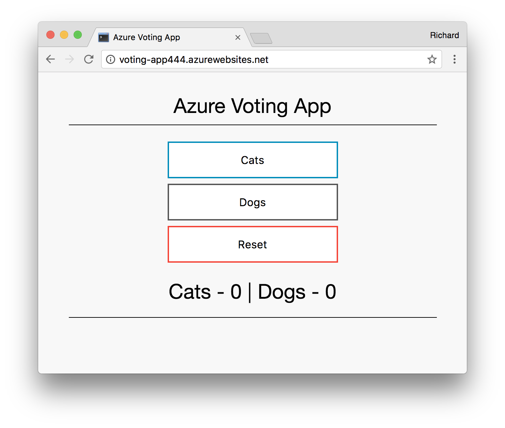
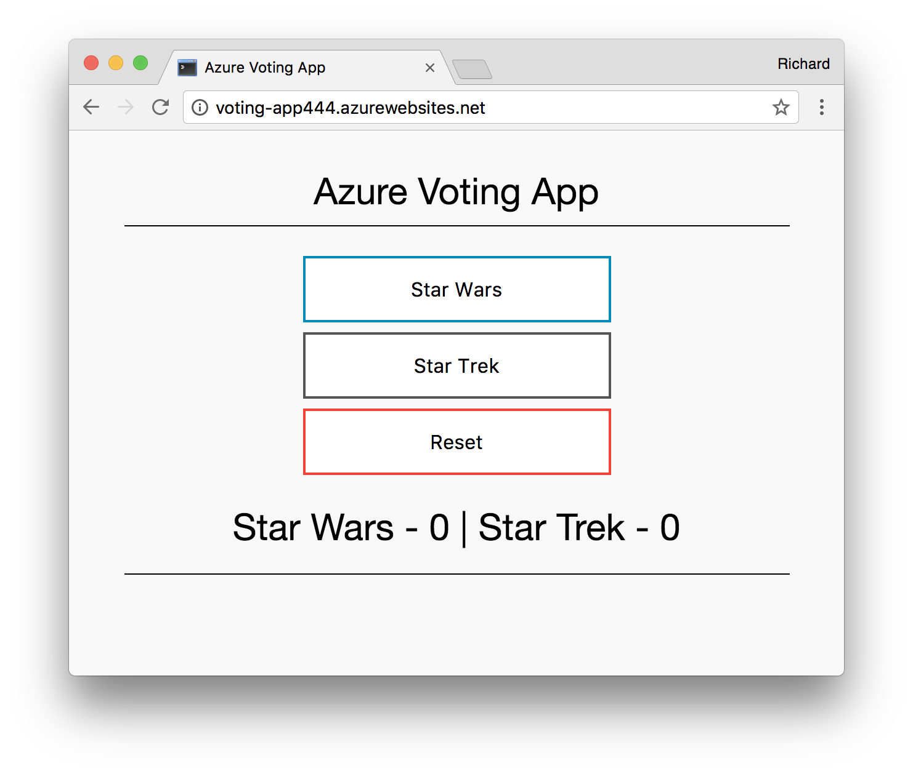

# Module 03: Web App for Containers

App Service provides pre-defined application stacks on Linux with support for specific versions, such as PHP 7.0 and Node.js 4.5. You can also use a custom Docker image to deploy your web app to an application stack that is not already defined in Azure. This module shows how to create a web app and deploy a Python image to it. You create the web app using the [Azure CLI](https://docs.microsoft.com/cli/azure/get-started-with-azure-cli).

## Prerequisites

To complete this tutorial you will need:

1. [Git](https://git-scm.com/)
2. [Azure CLI](https://docs.microsoft.com/cli/azure/get-started-with-azure-cli) or use [Azure Cloudshell](https://docs.microsoft.com/en-us/azure/cloud-shell/quickstart)
3. [Docker for Mac](https://store.docker.com/editions/community/docker-ce-desktop-mac) or [Docker for Windows](https://store.docker.com/editions/community/docker-ce-desktop-windows) -- see [Docker.com](https://www.docker.com/) for other installs
4. [Docker Hub Account](https://hub.docker.com/) -- Free account for public image storage

This tutorial assumes you have an active Azure Subscription, otherwise a free trial can be used (or using the Free Tier of App Service).

If you don't have an Azure subscription, create a [free account](https://azure.microsoft.com/free/) before you begin.

You should already have this sample code downloaded but if not:

Clone this repo:

```bash
git clone https://github.com/AzureCAT-GSI/azure-serverless-workshop.git
```

Switch to the correct folder:

```bash
cd 03_web-app-for-containers
```

## Test and Run Container Locally

If you are new to Docker and containers, it would be helpful to review the following [Getting Started Guide](https://docs.docker.com/get-started/) on Docker.com. If you are new to containers in general, please also read [What is a Container?](https://www.docker.com/what-container) on Docker.com.

We have copied over the exact same code that we had running in Module 02, however we are now going to package everything as a Docker image and push that to Docker Hub. This image will package our specific Python runtime, the code itself, any settings we require, and the command we want to execute to start the application. This is typically described using a file known as a [Dockerfile](https://docs.docker.com/engine/reference/builder/), please note also [Dockerfile best practices](https://docs.docker.com/engine/userguide/eng-image/dockerfile_best-practices/).

Now lets build the docker image. To do so you will need a Docker Hub account (linked above in the prereqs) and a public repository.

From the `03_web-app-for-containers` folder, run the following command replacing `<DockerHubUsername>` with your Docker Hub user name. 

```
docker build -t <DockerHubUsername>/<AppName> .
```

For instance:

```
docker build -t richardjortega/voting-app .
```

Let's review what happened:
- `docker` - the Docker daemon/engine that runs, manages, and creates Docker images
- `build` - the build command tells Docker to get ready to build a Docker image based on a Dockerfile.
- `-t` - we need to tag our image with our user name so that we push to Docker Hub it is accept correctly
- `<DockerHubUsername>/voting-app` - the name of our Docker Hub account and the name of the app (e.g. voting-app) we want to name it.
- `.` - the dot is used to mean "current directory", in this case it provides the build command reference to find the Dockerfile.

Once build finishes, you can view local images using the following command:

```
docker images
```

Output should look like:

```
REPOSITORY                      TAG                 IMAGE ID            CREATED             SIZE
richardjortega/voting-app         latest         18798f955b75        5 minutes ago       99.4MB
```

Test the application functions locally using the following Docker command:

```
docker run -p 80:80 richardjortega/voting-app
```

That command maps the exposed port of 80 from within the container to the host's port of 80. Now you can see it at
- [http://localhost](http://localhost)

You can exit the container with `CTRL+C`.

Now that we have tested our application locally, let's push this to the Docker Hub so that Web App for Containers will receive it.

To do so you will have to login within your Docker environment and enter your username and password, to do so run the following command:

```
docker login
```

Lets now push the image up to DockerHub

```
docker push <DockerHubUsername>/voting-app
```

It will look something like this:
```
docker push richardjortega/voting-app
```

The image we pushed is public and now downloadable via Docker Hub to any machine or server. In a production scenario, you would have a private container registry like [Azure Container Registry](https://azure.microsoft.com/en-us/services/container-registry/). You can find details [here](https://docs.microsoft.com/en-us/azure/app-service/containers/app-service-linux-cli#using-docker-images-from-a-private-registry).

## Deploying the custom Docker image to Azure  

### Configure Deployment User

**Note**: If you've created a deployment user in Module 02, you can skip this section.

A deployment user is required for FTP and local Git deployment to a web app. The user name and password are account level. They are different from your Azure subscription credentials.

In the following command [az webapp deployment user set](https://docs.microsoft.com/en-us/cli/azure/webapp/deployment/user?view=azure-cli-latest#az_webapp_deployment_user_set), replace <username> and <password> with a new user name and password. The user name must be unique. The password must be at least eight characters long, with two of the following three elements: letters, numbers, symbols.

```
az webapp deployment user set --user-name <username> --password <password>
```

If you get a 'Conflict'. Details: 409 error, change the username. If you get a 'Bad Request'. Details: 400 error, use a stronger password.

You create this deployment user only once; you can use it for all your Azure deployments.

*Record the user name and password. You need them to deploy the web app later.*

### Create Resource Group

The following example uses the [az group create](https://docs.microsoft.com/en-us/cli/azure/group?view=azure-cli-latest#az_group_create) creates a resource group named serverlessWorkshop02 in the East US location.

```
az group create --name serverlessWorkshop03 --location eastus
```

You generally create your resource group and the resources in a region near you. To see all supported locations for Azure Web Apps, run the `az appservice list-locations` command.

 ### Create App Service Plan

An [App Service plan](https://docs.microsoft.com/en-us/azure/app-service/azure-web-sites-web-hosting-plans-in-depth-overview) specifies the location, size, and features of the web server farm that hosts your app. You can save money when hosting multiple apps by configuring the web apps to share a single App Service plan.

**Note**: It is important to know what types of applications you will be deploying to App Service. For instance, you cannot deploy Linux and non-Linux (e.g. Windows) applications in the same App Service Plan. 

We will create an App Service Plan that used Linux as it's default environment using the `--is-linux` flag. This feature requires using an App Service Plan of `Standard` or `Premium`.

The following example uses the [az appservice plan create](https://docs.microsoft.com/en-us/cli/azure/appservice/plan?view=azure-cli-latest#az_appservice_plan_create) creates an App Service plan named `myAppServicePlan` in the **Standard** pricing tier:

```
az appservice plan create --name myAppServicePlan --resource-group serverlessWorkshop03 --sku S1 --is-linux
```

When the App Service plan has been created, the Azure CLI shows information similar to the following example:

```json
{ 
  "adminSiteName": null,
  "appServicePlanName": "myAppServicePlan",
  "geoRegion": "West Europe",
  "hostingEnvironmentProfile": null,
  "id": "/subscriptions/0000-0000/resourceGroups/myResourceGroup/providers/Microsoft.Web/serverfarms/myAppServicePlan",
  "kind": "app",
  "location": "West Europe",
  "maximumNumberOfWorkers": 1,
  "name": "myAppServicePlan",
  < JSON data removed for brevity. >
  "targetWorkerSizeId": 0,
  "type": "Microsoft.Web/serverfarms",
  "workerTierName": null
} 
```

## Create a web app

From your terminal window, create a web app in the `myAppServicePlan` App Service plan with the [az webapp create](https://docs.microsoft.com/en-us/cli/azure/webapp?view=azure-cli-latest#az_webapp_create) command. 

In the following command, replace *\<app_name>* with a unique name (valid characters are `a-z`, `0-9`, and `-`). If `<app_name>` is not unique, you get the error message "Website with given name <app_name> already exists." The default URL of the web app is `https://<app_name>.azurewebsites.net`. 

```bash
az webapp create --resource-group serverlessWorkshop03 --plan myAppServicePlan --name <app name> --deployment-container-image-name <DockerHubUsername>/<AppName>
```

In the preceding command, `--deployment-container-image-name` points to the public Docker Hub image on Docker Hub. 

When the web app has been created, the Azure CLI shows output similar to the following example:

```json
{
  "availabilityState": "Normal",
  "clientAffinityEnabled": true,
  "clientCertEnabled": false,
  "cloningInfo": null,
  "containerSize": 0,
  "dailyMemoryTimeQuota": 0,
  "defaultHostName": "<app name>.azurewebsites.net",
  "deploymentLocalGitUrl": "https://<username>@<app name>.scm.azurewebsites.net/<app name>.git",
  "enabled": true,
  < JSON data removed for brevity. >
}
```

## Browse to the app

Deployment can take an initial bit of time as it has to download the base Docker image which can be up to a 1GB or more. In production environments, you would pick a container base image that is small and only has what you need.

Browse to the following URL using your web browser.

```bash
http://<app_name>.azurewebsites.net
```



**Congratulations!** You've deployed a custom Docker image to Web App for Containers.

## Update the app

Similar to the exercise in Module 02 we can update our container.

Using a local text editor, open the `config_file.cfg` file in the folder `src`, and make a change to the value of `VOTE1VALUE` and `VOTE2VALUE`:

```python
VOTE1VALUE = 'Star Wars'
VOTE2VALUE = 'Star Trek'
```

We will now need to rebuild the image, running the same command as before:

```
docker build -t <DockerHubUserName>/voting-app .
```

Example:

```
docker build -t richardjortega/voting-app .
```

We will need to push this local image up to Docker Hub.

```
docker push <DockerHubUsername>/voting-app
```

It will look something like this:
```
docker push richardjortega/voting-app
```

Now we need to tell Azure that we have an update to our container (*Note*: In production environments, you may want to enable [CI/CD for Web App for Containers](https://docs.microsoft.com/en-us/azure/app-service/containers/app-service-linux-cli#enable-continuous-deployments-for-custom-docker-images))

```
az webapp restart --name voting-app444 --resource-group serverlessWorkshop03
```

This will tell App Service to restart it which forces it to check if there have been any updates to the image (and if there are, download the updated layers).

Note that this may take a moment to restart depending on the changes, given our changes up to a minute should be expected.

Browse to the following URL using your web browser.

```bash
http://<app_name>.azurewebsites.net
```

